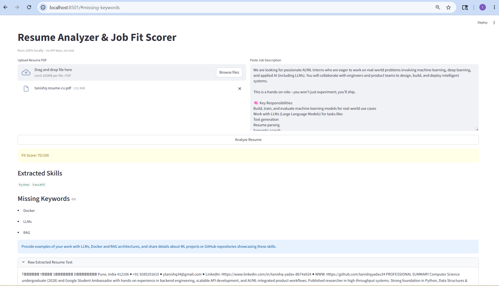

# 🎯 ResumeIQ — AI-Powered Resume Analyzer & Job Fit Scorer

> Upload your resume. Paste a job description. Get an AI-generated fit score, skill gap analysis, and actionable suggestions in seconds.

**[🚀 Live Demo →](https://your-streamlit-url.streamlit.app)**



---

## What it does

Most resume tools just keyword-match. ResumeIQ uses a full RAG (Retrieval-Augmented Generation) pipeline to semantically understand your resume against a job description — the same way a technical recruiter would.

You get:
- **Fit Score (0–100)** — how well your resume matches the JD
- **Extracted Skills** — what the AI found in your resume
- **Missing Keywords** — what the JD expects that you haven't mentioned
- **Improvement Suggestion** — one concrete action to improve your match

---

## Architecture
PDF Upload
↓
Text Extraction (pdfplumber)
↓
Chunking (500-word overlapping windows)
↓
Local Embeddings (sentence-transformers / all-MiniLM-L6-v2)
↓
Vector Store (ChromaDB in-memory)
↓
Semantic Retrieval (top-5 chunks vs JD query)
↓
LLM Inference (Llama 3.3 70B via Groq API)
↓
Structured JSON Output → Fit Score + Skills + Gaps

---

## Tech Stack

| Layer | Tool | Purpose |
|-------|------|---------|
| LLM | Llama 3.3 70B (Groq) | Resume analysis & scoring |
| Embeddings | sentence-transformers | Semantic chunk encoding |
| Vector DB | ChromaDB (in-memory) | Similarity search |
| Backend | FastAPI | REST API + PDF handling |
| Frontend | Streamlit | Interactive UI |
| Deployment | Render + Streamlit Cloud | Cloud hosting |

---

## Run Locally

### Prerequisites
- Python 3.11+
- Groq API key (free at [console.groq.com](https://console.groq.com))

### Setup

```bash
# Clone the repo
git clone https://github.com/YOUR_USERNAME/resume-analyzer.git
cd resume-analyzer/resume_analyzer

# Install dependencies
pip install -r requirements.txt

# Add your Groq API key
echo "GROQ_API_KEY=your_key_here" > .env

# Start backend
python -m uvicorn backend.main:app --reload --port 8000

# Start frontend (new terminal)
python -m streamlit run frontend/app.py
```

Open [http://localhost:8501](http://localhost:8501)

---

## Project Structure
resume_analyzer/
├── backend/
│   ├── main.py          # FastAPI app + /analyze endpoint
│   ├── parser.py        # PDF extraction + text chunking
│   ├── embedder.py      # Embeddings + ChromaDB vector store
│   ├── analyzer.py      # RAG retrieval + Groq LLM call
│   └── models.py        # Pydantic response models
├── frontend/
│   └── app.py           # Streamlit UI
├── Procfile             # Render deployment config
├── runtime.txt          # Python version for Render
└── requirements.txt

---

## Key Engineering Decisions

**Why RAG instead of sending the full resume?**
LLMs have context limits and hallucinate on long inputs. By chunking the resume and retrieving only the most semantically relevant sections for each JD, the model gets focused, high-signal context — producing more accurate scores.

**Why sentence-transformers locally?**
Zero latency, zero cost, no API dependency for embeddings. The `all-MiniLM-L6-v2` model is 90MB and runs in milliseconds on CPU.

**Why Groq?**
Groq's LPU inference hardware delivers responses in under 3 seconds for Llama 3.3 70B — faster than GPT-4o on most prompts, and free tier is sufficient for demo use.

---

## Author

**Tanishq Yadav** — AI/ML Engineer
- GitHub: [github.com/tanishqyadav34](https://github.com/tanishqyadav34)
- LinkedIn: [linkedin.com/in/tanishq-yadav-8b74a924](https://linkedin.com/in/tanishq-yadav-8b74a924)
- Email: ytanishq34@gmail.com